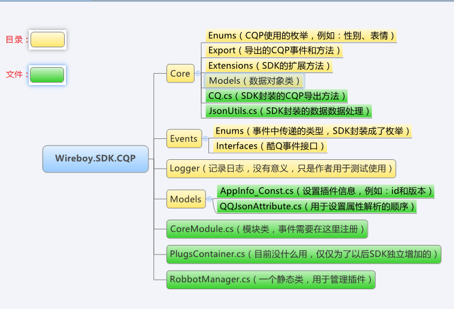
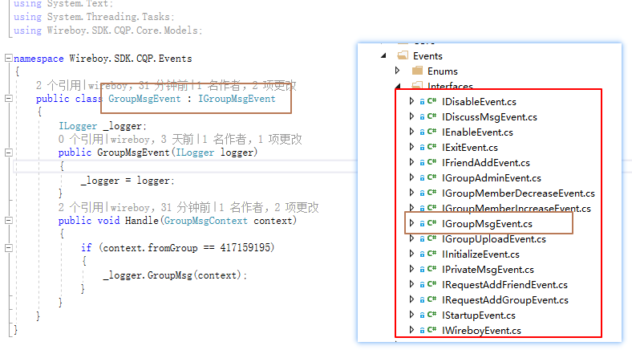
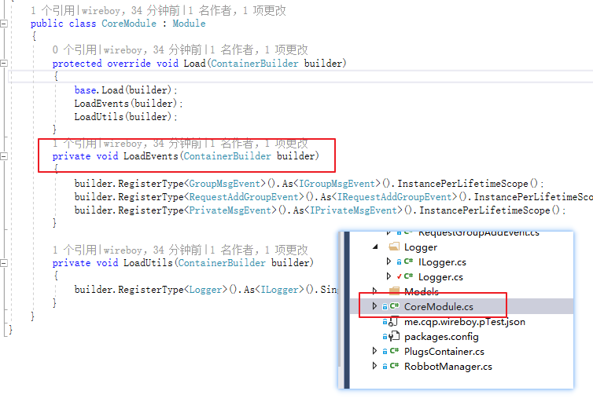
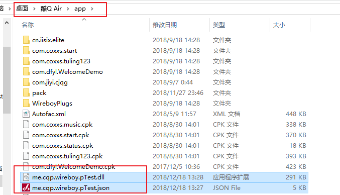
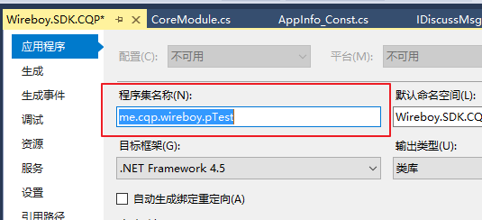
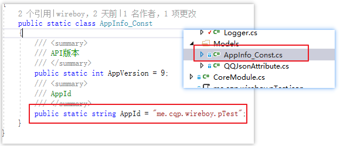
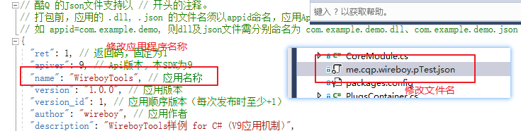

# Wireboy.SDK.CQP

先点击一下右上角的Star，开启隐藏功能。

加入QQ群417159195，掌握更多机器人SDK开发进度。

## 先来个自我介绍

这是一个.Net框架下的C#开发的酷Q机器人SDK。嗯...这真是SDK吗？

No，目前还不是，因为你必须使用该项目进行插件开发，还不能单独引用。所以说，目前此项目处于开发的初级阶段。

那么后面会实现单独引用dll就可以开发吗？

如果仅仅只是引用dll就开发，就目前看来是比较困难的，但是后面项目成熟后，我会将SDK功能会逐步独立，然后做一个项目模板，利用项目模板建立自己的机器人插件是完全可行的。

## SDK结构

## 范例：发送消息

 

## 实现第一个机器人（记录Q群消息）

第一步：实现接口

新增GroupMsgEvent类，继承IGroupMsgEvent接口

第二步：注册接口

在CoreModule中注册接口

第三步：复制文件到机器人目录

## 如何修改插件名？

### 第一步：修改程序集名称

### 第二步：修改插件id

### 第三步：修改json文件名和应用程序名称

json文件名称需要与第一步的程序集名称一致

## 最后**最重要的，一定要Star一下！**

本SDK开源代码仅为促进.Net开源学习使用

由此开源SDK制作的任何产品与本SDK无关

禁止用于国家或地区法律法规所禁止的范围！

